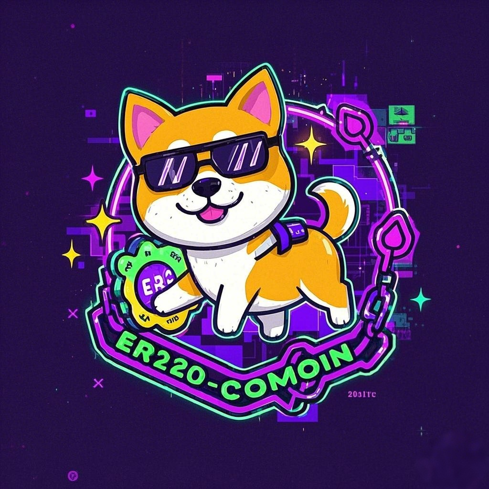

[![Contributors][contributors-shield]][contributors-url]
[![Issues][issues-shield]][issues-url]
[![Unlicense License][license-shield]][license-url]
[![LinkedIn][linkedin-shield]][linkedin-url]

<!-- PROJECT LOGO -->
 

  

  <h3 align="center">Best-README-Template</h3>

  

    An awesome README template to jumpstart your projects!
     
    <a href="https://github.com/jardaliao/ERC20-demo"><strong>Explore the docs »</strong></a>
     
     
    <a href="https://github.com/jardaliao/ERC20-demo">View Demo</a>
    &middot;
    <a href="https://github.com/jardaliao/ERC20-demo/issues/new?labels=bug">Report Bug</a>
    &middot;
    <a href="https://github.com/jardaliao/ERC20-demo/issues/new?labels=enhancement">Request Feature</a>
  

<!-- MARKDOWN LINKS & IMAGES -->
[contributors-shield]: https://img.shields.io/github/contributors/jardaliao/erc20-demo.svg?style=for-the-badge
[contributors-url]: https://github.com/jardaliao/erc20-demo/graphs/contributors
[issues-shield]: https://img.shields.io/github/issues/jardaliao/ERC20-demo.svg?style=for-the-badge
[issues-url]: https://github.com/jardaliao/ERC20-demo/issues
[license-shield]: https://img.shields.io/github/license/jardaliao/ERC20-demo.svg?style=for-the-badge
[license-url]: https://github.com/jardaliao/ERC20-demo/blob/main/license.txt
[linkedin-shield]: https://img.shields.io/badge/-LinkedIn-black.svg?style=for-the-badge&logo=linkedin&colorB=555
[linkedin-url]: https://linkedin.com/in/jie-liao-a16900307
[product-screenshot]: images/screenshot.png